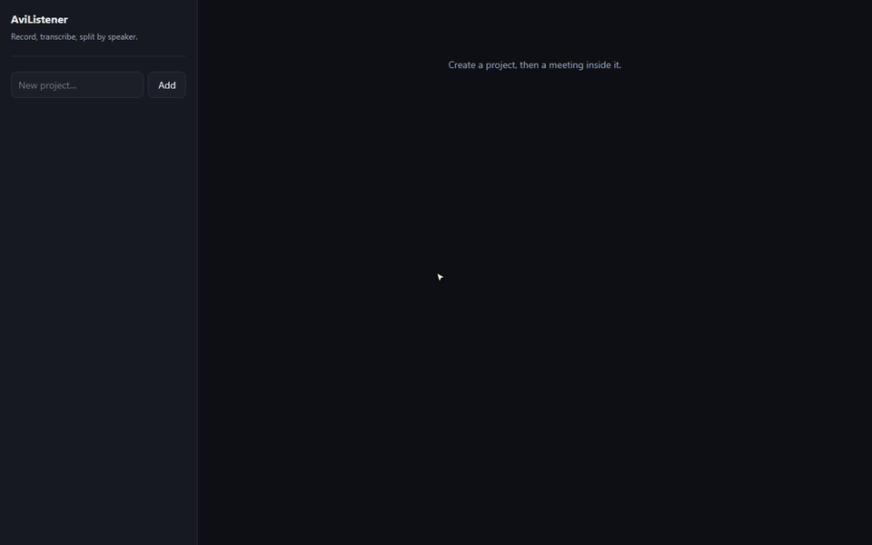
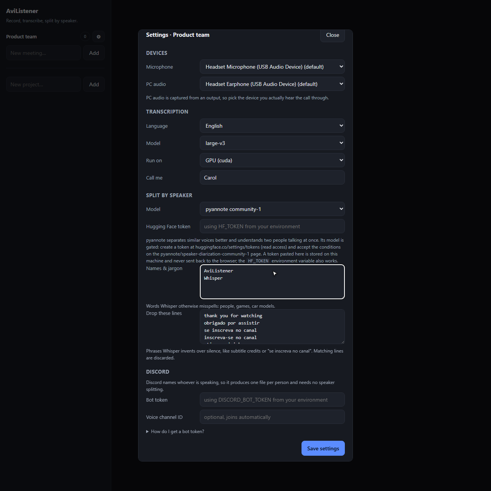
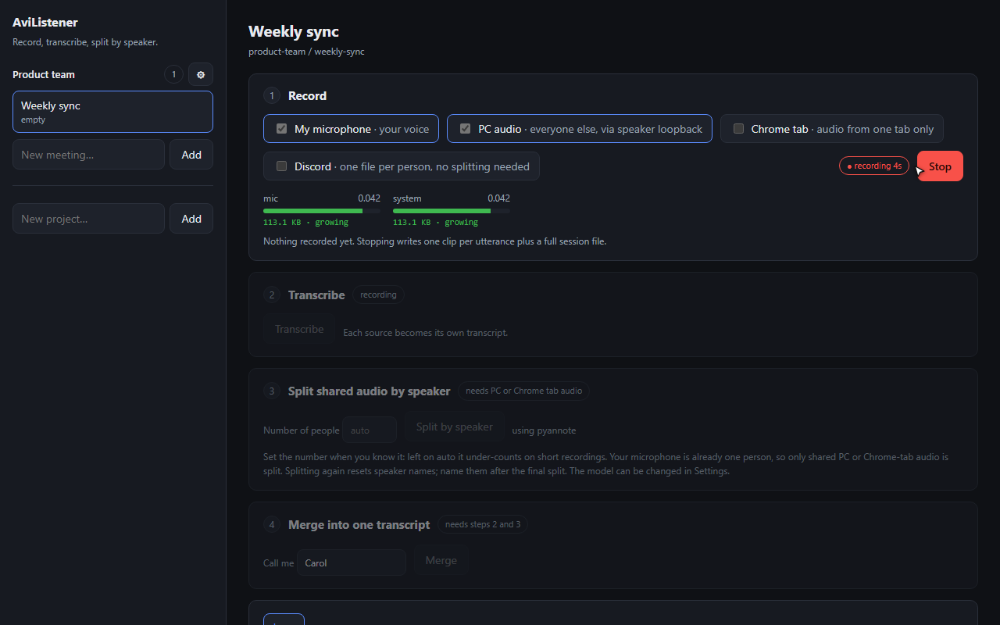
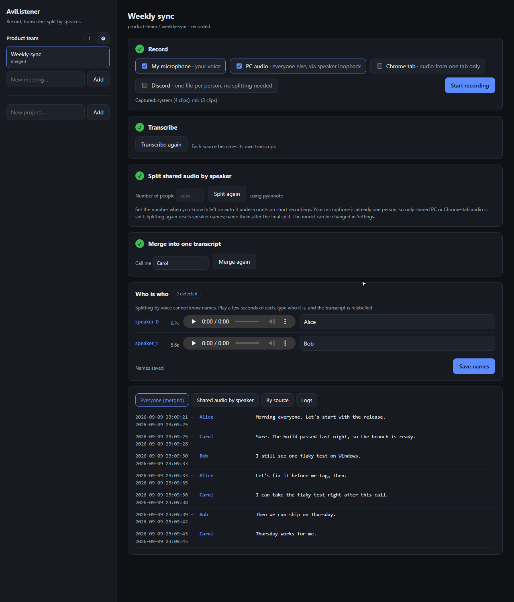
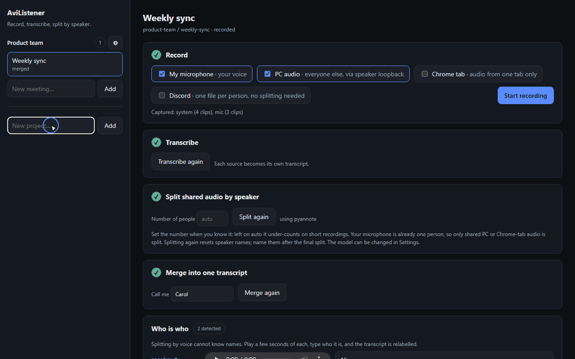

# AviListener

Local app for Windows that records your meetings or RPG sessions, transcribes them using AI, and automatically labels who said what.

### **100% offline and private** - nothing is uploaded to the cloud




---

Easier way to install this is to use your local agent (Claude Code, Codex, Cursor, Copilot), just paste the prompt on [AGENT_SETUP.md](AGENT_SETUP.md) or even better, just say:

```
Install the tool from this repo https://github.com/matheusavi/avi-listener/blob/main/AGENT_SETUP.md
```


## Prerequisites

* **OS:** Windows 10 or 11
* **Python:** 3.11 (with `py` launcher)
* **Node.js:** 22.12+
* **GPU:** NVIDIA GPU (CUDA) recommended for speed *(CPU mode supported)*
* **Hugging Face Account:** Free account required to download the speaker-splitting model.


## Manual setup

1. Open PowerShell in the project folder and run:
```powershell
.\setup.ps1
```


*(For CPU-only machines, use `.\setup.ps1 -Cpu`)*

2. Start the app:
```powershell
.\.venv\Scripts\avilistener.exe dashboard
```

3. Open your browser and go to **<http://127.0.0.1:8000>**

*To keep it running in the background after closing your terminal, run `.\start-background.ps1` instead. It writes dated logs in the project folder and does not start again after a reboot.*


## Setting Up for RPG Sessions

Before starting your first session, open **Settings** (gear icon) in the dashboard:

1. **Devices:** Select your microphone and the output device where you hear your players (e.g., your headphones).
2. **Hugging Face Token:** Accept conditions on the [`pyannote/speaker-diarization-community-1`](https://huggingface.co/pyannote/speaker-diarization-community-1) page, generate a read-access token, and paste it into Settings.
3. **Names & Jargon:** Add character names, location names, and game terms (e.g., *Strahd, Eldritch, Faerûn*) so Whisper spells them correctly.
4. **Language:** Set to your spoken language.




## How to Record & Transcribe a Session

AviListener structures recordings into **Projects > Meetings**.

1. **Create a Project & Session:** Set up a project (e.g., *D&D Campaign*) and create a session folder for today's game.
2. **Select Sources & Record:**
* **My Microphone:** Captures your voice (the DM/Host).
* **PC Audio:** Captures players over Discord, Zoom, or Google Meet.
* **Chrome Tab / Discord:** Alternative direct inputs for single tabs or Discord voice bots.



While recording, each source shows its file size growing. If it turns red with **not growing**, that device is not delivering audio: fix it now rather than finding out from an empty transcript.

Stopped early or lost the connection? Open the same session and press **Start recording** again. Each part is kept, and the steps below process all parts together on one timeline. If you record another part after transcribing, the dashboard marks the old results as out of date so you know to run them again.

3. **Transcribe & Split:**
* Click **Transcribe** when the session ends.
* Click **Split by Speaker** to group voices.


4. **Name Your Players:**
* Go to the **Who is who** panel.
* Listen to a quick 3-second sample for each speaker (`speaker_0`, `speaker_1`) and type the player or character name. The transcript updates instantly.
* Name them after the final split: splitting again renumbers the speakers.



### Recording Discord instead

With a bot in the voice channel, Discord already tells us who is speaking, so each participant arrives as their own file and no speaker splitting is needed. Tick **Discord**, pick the channel, record, transcribe.




## Privacy & Storage

* All audio, transcripts, and settings are saved locally inside the `workspace/` folder (git-ignored).
* Internet connection is only used to download models during the initial setup.


## License

[MIT](LICENSE)
